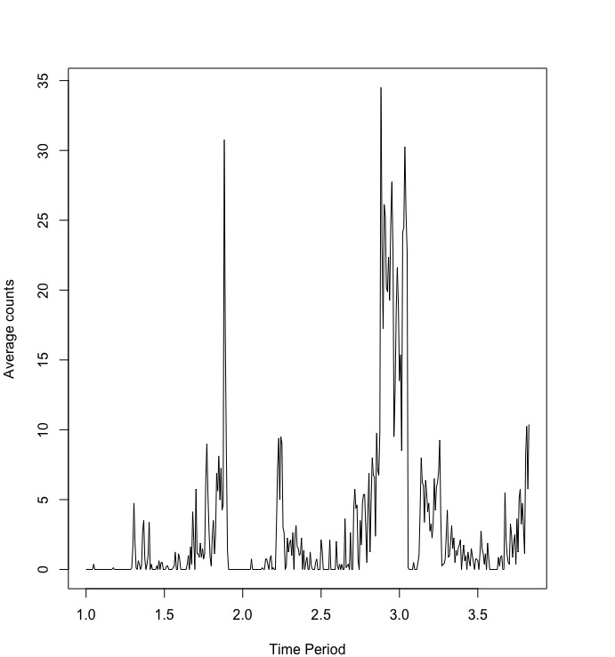
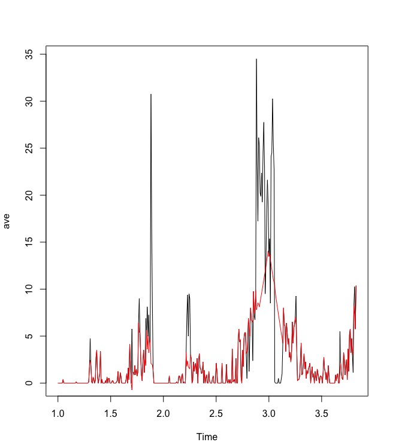
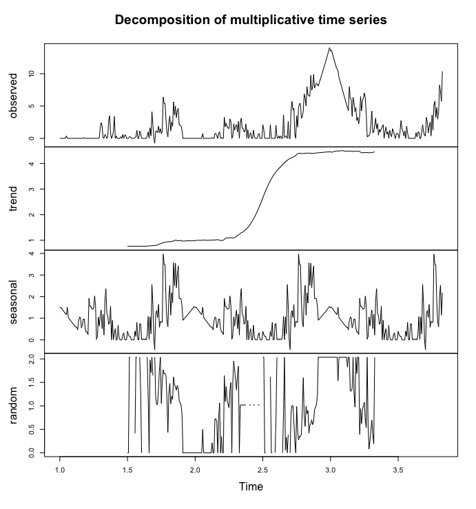
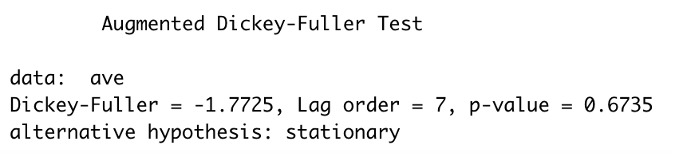
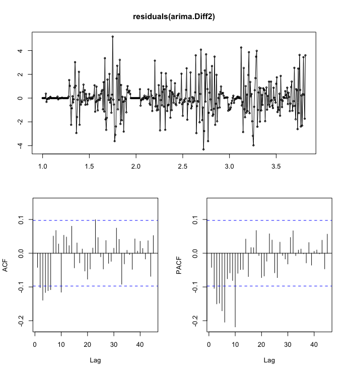
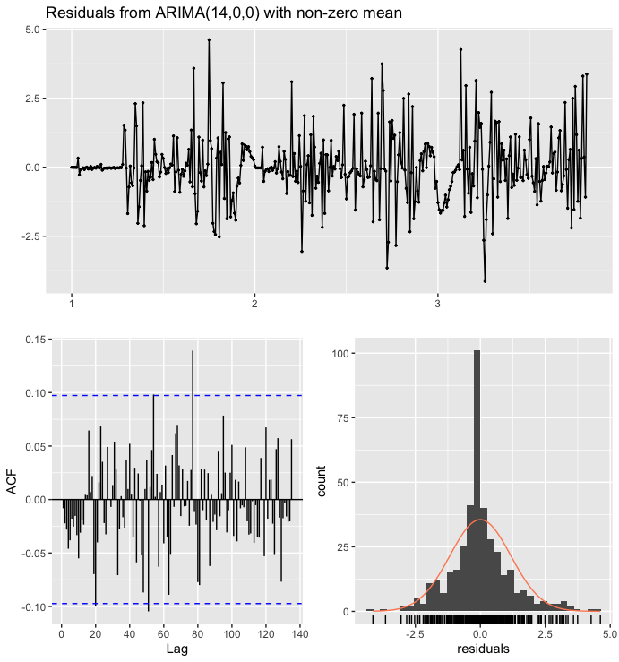
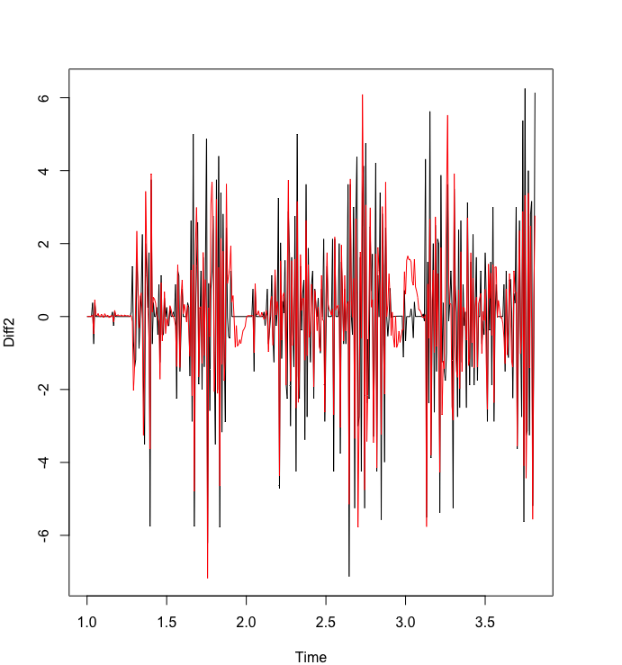
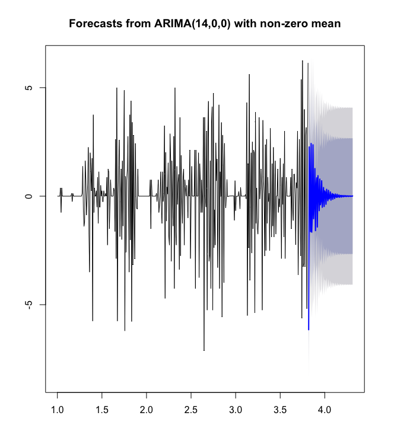

Introduction:

An endogenous circadian clock can interact with a light-dark cycle to determine the behavioral rhythm expression at the physiological, molecular, and behavioral levels. In mosquitoes, there exist multiple chronobiology studies where circadian phenotypes have been shown to influence activities like sugar feeding, blood feeding, oviposition, and locomotor activity (Edman 1977; Meireles-Filho & Kyriacou et al. 2013; Gatton et al. 2013 ). The detoxification of oxidative stress is another process that has been found in Ae. aegypti to be regulated by the circadian clock, and this process is often caused by insecticide usage, like the use of pyrethroids (Yang et al. 2010). The association in Ae. aegypti made between the CYP9M9 detoxification gene and the clock gene period moreover show elevated expression during the dusk period, where there is typically increased activity, host-seeking, and oviposition (Yang et al. 2010). Pyrethroids are relevant due to the local application of this insecticide by Miami-Dade County (Miami Dade Mosquito Control). Although morphological and physiological resistance pathways such as metabolic resistance, target site modifications, and cuticle thickness are typically studied (Vontas et al. 2012), understanding possible behavioral resistance, like a circadian-regulated behavioral phenotype in this organism, has not yet been well-studied. Behavioral resistance has been defined as a modification of vector behavior that allows for insecticide avoidance, allowing a mosquito to escape without harm (Carrasco et al. 2019). This study will compare the locomotor activity of second-generation wild-caught Ae. aegypti mosquitoes with that of a susceptible laboratory strain of Ae. aegypti, “Orlando”. This strain was chosen as reference to what the mosquito’s conserved circadian rhythm would look like since it is not insecticide resistant and has not been exposed to any insecticide chemicals that may affect behavior since its laboratory establishment (Kuno 2010).

Methods:

Subsequent generations of field-collected mosquito lines and Orlando control were hatched and allowed to mate for three days after eclosure in the BugDorm. After the three day period, Orlando and field-caught female mosquitoes were transferred into smaller, clear containers where they were entrained for two days in a 14:10 Light:Dark cycle at 27º C in a Tritech DigiTherm® incubator. Mosquitoes from the batches that were previously entrained in the incubators were moved as individuals into the glass tubes of the TriKinetics Locomotor Activity Monitor (LAM) with a cotton ball on each side, one dry and one soaked in 10% sucrose. The LAM monitor records locomotor activity through the use of an infrared beam-break assay which is located in the middle of the monitor measuring movement when interrupted by a passing mosquito. The LAM ran for 3 days. The data was used to create a timeseries through the use of ARIMA model. The model's goal for the purposes of this study is to better understand circadian rhythm trends in laboratory versus wild mosquitoes and also to test if it is possible to predict future peaks in activity movement in Ae. aegypti mosquitoes by examining the differences between values in the series instead of through actual values. In order to prepare for building an ARIMA model, the time series is separated into the seasonal, trend and irregular components to understand it’s behavior. The Seasonal component would refer to fluctuations in the data related to circadian rhythm cycles. The time series will also be tested for stationarity. This is because ARIMA uses previous lags of series to model its behavior and modeling a stable series with consistent properties involves less uncertainty. Autocorrelation plots will also be made as a useful visual tool in determining whether a series is stationary. ACF plots display correlation between a series and its lags. Partial autocorrelation plots (PACF) will display correlation between a variable and its lags that is not explained by previous lags. 

Results:

Graph1: Orlando female non-gravid mosquito locomotor activity throughout the period of four days. The average counts were collected every ten minutes. The time period has been set to encompass a full 24 hour day.

Graph2: Removal of any outliers from Graph1 (Orlando time series) that could bias the model by skewing statistical summaries.

Graph3: This deconstruction of the time series of Graph1 (Orlando time series) separates the time series into the seasonal, trend and irregular components. The Seasonal component refers to fluctuations in the data related to daily Light:Dark cycles. Trend component is the overall pattern of the series. It consists of decreasing or increasing patterns that are not seasonal. This is estimated using moving averages.The part of the series that can’t be attributed to the seasonal or trend components is referred to as residual or error.

The augmented Dickey-Fuller (ADF) was used as a formal statistical test for stationarity. The null hypothesis assumes that the series is non-stationary. ADF procedure tests whether the change in Y can be explained by lagged value and a linear trend. Here, he lagged value to the change in Y is non-significant and there is a presence of a trend component, the series is non-stationary and null hypothesis will not be rejected. This means that statistical properties such as the mean, variance and autocorrelation are not constant over time. Because of this, a differenced the time series was also tested with ADF for the differenced time series had a p-value of 0.01.  the Kwiatkowski-Phillips-Schmidt-Shin (KPSS) test was also used to identify trend-stationarity in the series, but with a p-value of 0.01, we reject the null hypothesis, series is not stationary. There were multiple steps of differencing taken. First-differencing the time series removed the linear trend (i.e., differences=1); twice-differencing removed the quadratic trend (i.e., differences=2). In addition, when first-differencing the time series at a lag equal to the period, it removed a seasonal trend (e.g., set lag=144 for daily collected data).

Graph4: Residuals plots show a smaller error range, more or less centered around 0. There is a clear pattern present in ACF/PACF and model residuals plots repeating at lag 10. This suggests that our model may be better off with a different specification, such as p = 10 or q = 10.

Graph5: After increasing the lag max to 140, the best model with the lowest AIC produced.

Graph6: The Ljung-Box test of independence at all lags up to the one specified was conducted. Testing the “overall” randomness based on a number of lags as a portmanteau test, that the residuals from the ARIMA model have no autocorrelation. In this case the p-value was 0.3458, confirming no significant difference from white noise.

Graph7: Temporal dynamics of the differenced data set for Orlando female locomotor activity.

Graph8: Potential forecast of temporal dynamics for Orlando female mosquitoes over the course of the next time period using the ARIMA model.

Discussion:

Unfortunately, due to laboratory constraints on data production, only Orlando female mosquitoes were able to be run and analyzed for the purposes of this study. The study however still elucidated varying components of this time series. For example, there seems to be a trend of increase activity from the second to the third day in mosquitoes within the LAM monitor. This was an issue for the ARIMA model, and steps were taken to ensure the trends would be removed for the model to be fitted into the data set. There also visually seems to be a seasonal trend shown in the decomposition possibly due to the specie's diurnal circadian rhythm for host-seeking, mating and oviposition activities. It was only after multiple steps of differencing taken that a forecast was achieved as an end product. This suggests there are many factors coming into play in mosquito locomotor activity or that an insufficient amount of data was collected for this purpose. It is possible in the future to conduct LAM trials for longer than the 3 day period. It seems that there may also have been many outliers still influencing the graph trends. This may be reduced by more rigorously removing outliers previous to importing data, or by increasing sample size and determining if the outliers may just be the peaks of activity. More analysis has to be done on field samples and a comparison of decomposed data may allow for a better view at possible differences between these mosquito populations.
