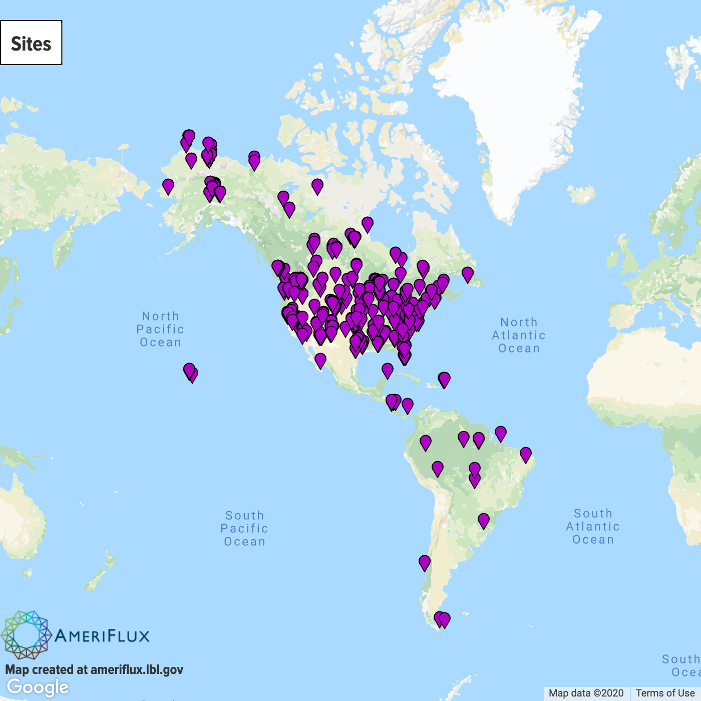

##### The harv dataframe includes flux data downloaded from Ameriflux (https://ameriflux.lbl.gov) for the Harvard Forest tower (Ha1). The only behind the scenes processing includes formating the timestamp and including year, and month. The harv dataset was then divided into two files: day (PAR > 0) and night (PAR == 0). In this assignment, the monthly temperature response curves is fitted using a similar approach with the night data from harv (night).

# Methods

## Site Information 

## Starting Values for Nonlinear Models:

#### Download necessary tools
library(nlstools)

#### Set your working directory
load("~/Desktop/QEco/NLM_Workshop.RData")

### Selfstart for the trc:
trcModel <- function(TA, a, b) {
  y=a * exp(b*TA)
  return(y)
}

### Create a function to find initial values for the selfstart function:
trc.int <- function (mCall, LHS, data){
  x <- data$TA
  y <- data$NEE
  
  a <-1.00703982 + -0.08089044* (min(na.omit(y)))
  b <- 0.051654 + 0.001400 * (min(na.omit(y))) 
  
  value = list(a, b)
  names(value) <- mCall[c("a", "b")]
  return(value)
}

### Selfstart Function
SS.trc <- selfStart(model=trcModel,initial= trc.int)

### Find initial values
iv <- getInitial(NEE ~ SS.trc('TA', "a", "b"), data = night[which(night$MONTH == j),])
iv

$a
[1] 1.451937

$b
[1] 0.043954

### Use initial values in the model

y = nls( NEE ~ a * exp(b*TA), night[which(night$MONTH == j),], start=list(a= iv$a , b= iv$b),
na.action=na.exclude, trace=F, control=nls.control(warnOnly=T))
summary(y)

### Converged model assumptions check, confidence intervals and plots
res.trc <- nlsResiduals(y)
par(mfrow=c(2,2))
plot(res.trc, which=1)# Residulas vs fitted values (Constant Variance) 
plot(res.trc, which=3) # Standardized residuals
plot(res.trc, which=4) # Autocorrelation
plot(res.trc, which=5) # Histogram (Normality)

### Bootstrap to estimate errors for the parameters by resampling the data
results <- nlsBoot(y, niter=100 )
summary(results)

plot(results, type = "boxplot")

# How variable are NEE rates over an annual cycle in Harvard Forest?
### Fitting temperature response curves monthly and comparing parameter values:

## Create a dataframe to store monthly parameter values (parms.Month):
parms.Month <- data.frame(
  MONTH=numeric(),
  a=numeric(),
  b=numeric(), 
  a.pvalue=numeric(),
  b.pvalue=numeric(), stringsAsFactors=FALSE, row.names=NULL)

parms.Month[1:12, 1] <- seq(1,12,1) # Creates time file to merge with parm file:

## Write a function to the fit model and extract parameters (nee.night):
nee.night <- function(dataframe){y.df = nls(NEE ~ a * exp(b*TA), 
                                            dataframe, start=list(a= iv$a , b=iv$b ),
                                            na.action=na.exclude, trace=F,
                                            control=nls.control(warnOnly=T))

y.df <- as.data.frame(cbind(t(coef(summary(y.df))[1:2, 1]), t(coef(summary(y.df)) [1:2, 4])))

names(y.df) <- c("a", "b", "a.pvalue", "b.pvalue")                      
return(y.df)}

## Write a loop to fit monthly curves and add parameters to a dataframe (parms.Month) (1:12):
try(for(j in unique(night$MONTH)){
  print(j)
  
### Determines starting values:
iv <- getInitial(NEE ~ SS.trc('TA', "a", "b"), data = night[which(night$MONTH == j),]) 
  
### Fits light response curve:
y4 <- try(nee.night(night[which(night$MONTH == j),]), silent=T) # Fit night model
  
### Extracts data and saves it in the dataframe
  try(parms.Month[c(parms.Month$MONTH == j ), 2:5 ] <- cbind(y4), silent=T)
  
  rm(y4)
}, silent=T)

parms.Month

## Bootstrapping for error estimation
### Create file to store parms and se
boot.NEE <- data.frame(parms.Month[, c("MONTH")]); names (boot.NEE) <- "MONTH"
boot.NEE$a.est<- 0
boot.NEE$b.est<- 0
boot.NEE$a.se<- 0
boot.NEE$b.se<- 0

### Night Model:
for ( j in unique(boot.NEE$MONTH)){
  print(j)
  y1 <-night[which(night$MONTH == j),]

### Determines the starting values:  
  iv <- getInitial(NEE ~ SS.trc('TA',"a", "b"), data = y1) 

### Fit curve:  
  night.fit <- nls(NEE ~ a * exp(b*TA), 
                   data=y1, start=list(a= iv$a , b=iv$b ),
                   na.action=na.exclude, trace=F,
                   control=nls.control(warnOnly=T))
  
### Bootstrap and extract values:
  try(results <- nlsBoot(night.fit, niter=100 ), silent=T)
  try(a <- t(results$estiboot)[1, 1:2], silent=T)
  try(names(a) <- c('a.est', 'b.est'), silent=T)
  try(b <- t(results$estiboot)[2, 1:2], silent=T)
  try(names(b) <- c('a.se', 'b.se'), silent=T)
  try(c <- t(data.frame(c(a,b))), silent=T)

### Add bootstrap data to dataframe:
  try(boot.NEE[c(boot.NEE$MONTH == j), 2:5] <- c[1, 1:4], silent=T)
  try(rm(night.fit, a, b, c, results, y1), silent=T)
}

trc <- merge( parms.Month, boot.NEE)

trc

# Results

# Discussion

