# Methods

# Site Information 

##### The harv dataframe includes flux data downloaded from Ameriflux (https://ameriflux.lbl.gov) for the Harvard Forest tower (Ha1). The only behind the scenes processing includes formating the timestamp and including year, and month. The harv dataset was then divided into two files: day (PAR > 0) and night (PAR == 0). In this assignment, the monthly temperature response curves is fitted using a similar approach with the night data from harv (night).

## Study Site: Harvard Forest

Location: Massachusetts 

Climate: Cool, moist temperate July mean temperature 20°C January mean temperature -7°C; Annual mean precipitation 110 cm, distributed fairly evenly throughout the year

Vegetation: Transition Hardwood - White Pine - Hemlock Region

Dominant species: Red oak (Quercus rubra) Red maple (Acer rubrum) Black birch (Betula lenta) White pine (Pinus strobus) Eastern hemlock (Tsuga canadensis)

#### Environmental Measurement Station Eddy Flux Tower (EMS)

#### Download necessary tools
library(nlstools)

#### Set your working directory
load("~/Desktop/QEco/NLM_Workshop.RData")

# Photosynthetic Potential

### Fitting Light Response Curves With nls():
To measure the relationship between photosynthetically active radiation (PAR; 400 - 700 nm) and net ecosystem exchange (NEE), we can fit a light response curve. Both TA and NEE are in μmol m^-2 s^-1.

The first step in fitting a nonlinear model is to take a look at the data.

plot( NEE ~ PAR, data= night)

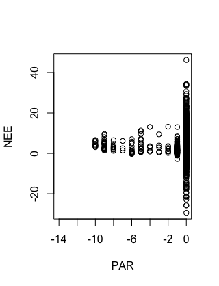

Figure 1 Net Ecosystem Exchange Rates relative to photosynthetically active radiation at Harvard forest from 1990 to 2016.

# Ecosystem Respiration

### Fitting temperature responce curves with nls():
plot( NEE ~ TA, data= night)

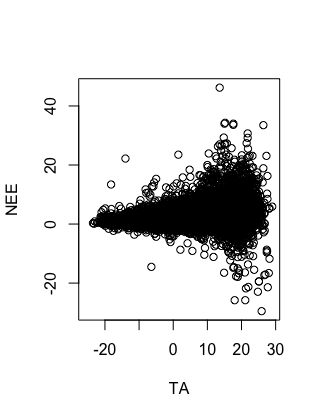

Figure 2. Net Ecosystem Exchange Rates relative to ecosystem respiration temperature sensitivity at Harvard forest from 1990 to 2016.

The temperature response curve model includes two parameters: a  is the base respiration rate when air temperature is 0 C and b  is an empirical coefficient. We can use the nls() estimator for the estimation of the parameters by specifying the model, data set, and starting values for the parameters.

## Starting Values for Nonlinear Models:

### Selfstart for the trc:

To reduce the bias introduced by the selection of starting values we can use selfStart to construct self-starting nonlinear models.

trcModel <- function(TA, a, b) {
  y=a * exp(b*TA)
  return(y)
}

### Create a function to find initial values for the selfstart function:

trc.int <- function (mCall, LHS, data){
  x <- data$TA
  y <- data$NEE
  
  a <-1.00703982 + -0.08089044* (min(na.omit(y)))
  b <- 0.051654 + 0.001400 * (min(na.omit(y))) 
  
  value = list(a, b)
  names(value) <- mCall[c("a", "b")]
  return(value)
}

### Selfstart Function

SS.trc <- selfStart(model=trcModel,initial= trc.int)

### Find initial values

iv <- getInitial(NEE ~ SS.trc('TA', "a", "b"), 
                 data = night[which(night$MONTH == j),])
iv

$a
[1] 1.451937

$b
[1] 0.043954

### Use initial values in the model

y = nls( NEE ~ a * exp(b*TA), night[which(night$MONTH == j),], start=list(a= iv$a , b= iv$b),
na.action=na.exclude, trace=F, control=nls.control(warnOnly=T))
summary(y)

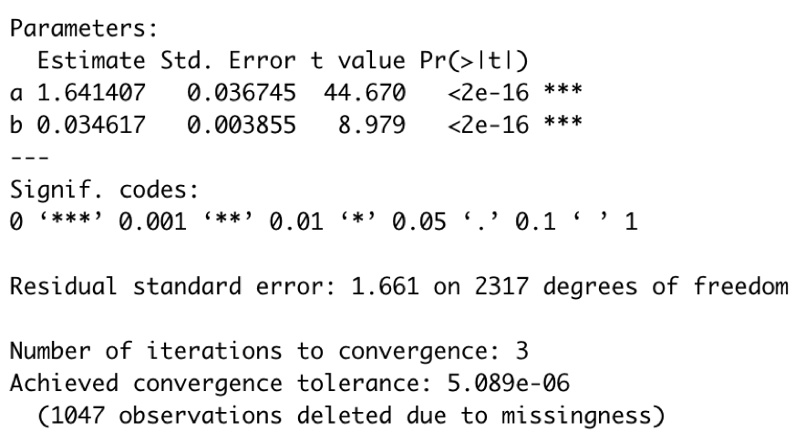

### Converged model assumptions check, confidence intervals and plots

res.trc <- nlsResiduals(y)
par(mfrow=c(2,2))
plot(res.trc, which=1)# Residulas vs fitted values (Constant Variance) 
plot(res.trc, which=3) # Standardized residuals
plot(res.trc, which=4) # Autocorrelation
plot(res.trc, which=5) # Histogram (Normality)

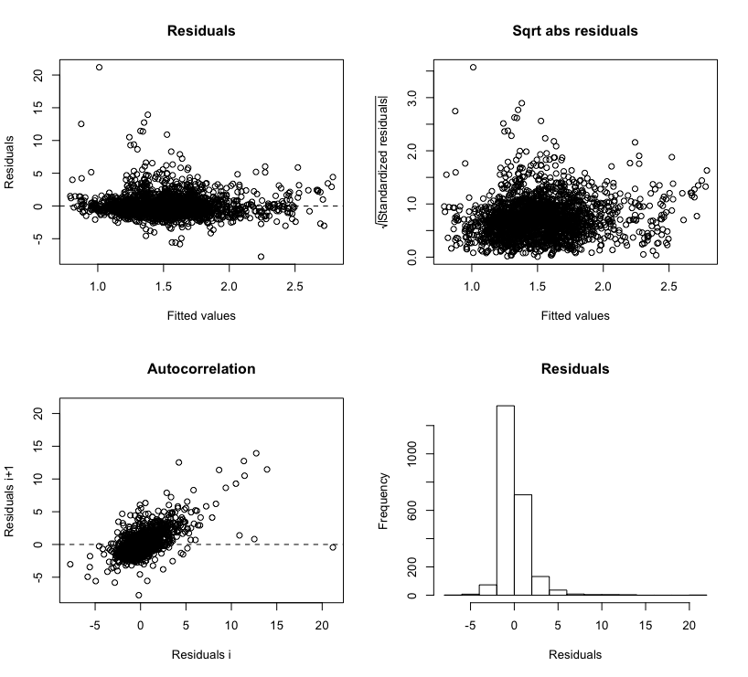

### Bootstrap to estimate errors for the parameters by resampling the data\

We can bootstrap to estimate errors for the parameters by resampling the data. The function nlsBoot() uses non-parametric bootstrap of mean centered residuals to obtain a number (niter) of bootstrap estimates. Bootstrap estimates and standard errors together with the median and percentiles confidence intervals are displayed by the summary(). The nlsBoot() provides confidence intervals even if the optimization algorithm fails to converge for some of the bootstrapped samples.

results <- nlsBoot(y, niter=100 )
summary(results)

plot(results, type = "boxplot")

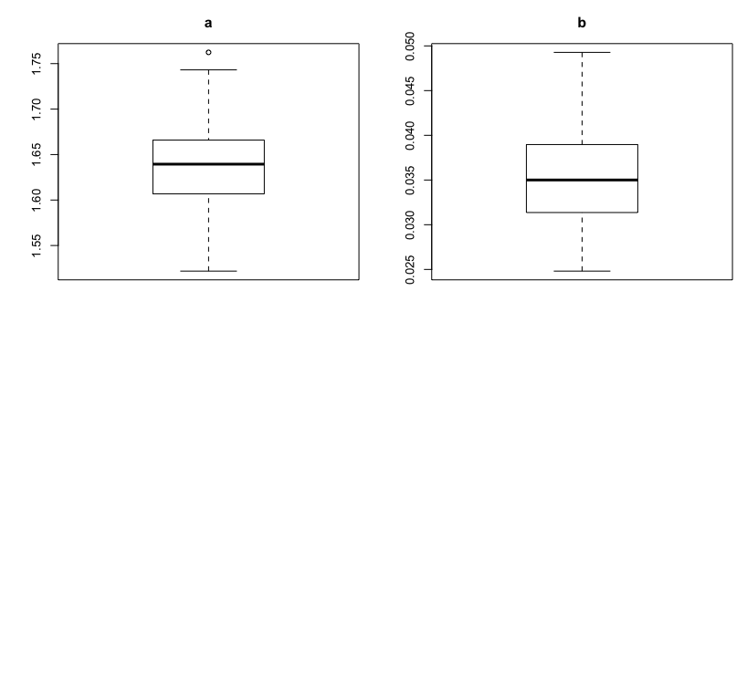

### First month

m1 = nls( NEE ~ a * exp(b*TA), night[which(night$MONTH == 1),], start=list(a= trc$a , b= trc$b),
na.action=na.exclude, trace=F, control=nls.control(warnOnly=T))
summary(m1)

res.trc <- nlsResiduals(m1)
par(mfrow=c(2,2))
plot(res.trc, which=1)# Residulas vs fitted values (Constant Variance) 
plot(res.trc, which=3) # Standardized residuals
plot(res.trc, which=4) # Autocorrelation
plot(res.trc, which=5) # Histogram (Normality)

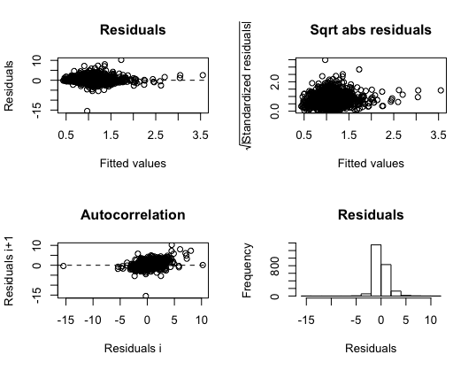

### Second month

m2 = nls( NEE ~ a * exp(b*TA), night[which(night$MONTH == 2),], start=list(a= trc$a , b= trc$b),
na.action=na.exclude, trace=F, control=nls.control(warnOnly=T))
summary(m2)

res.trc <- nlsResiduals(m2)
par(mfrow=c(2,2))
plot(res.trc, which=1)# Residulas vs fitted values (Constant Variance) 
plot(res.trc, which=3) # Standardized residuals
plot(res.trc, which=4) # Autocorrelation
plot(res.trc, which=5) # Histogram (Normality)

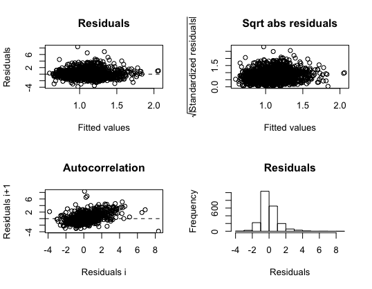

### Third month

m3 = nls( NEE ~ a * exp(b*TA), night[which(night$MONTH == 3),], start=list(a= trc$a , b= trc$b),
na.action=na.exclude, trace=F, control=nls.control(warnOnly=T))
summary(m3)

res.trc <- nlsResiduals(m3)
par(mfrow=c(2,2))
plot(res.trc, which=1)# Residulas vs fitted values (Constant Variance) 
plot(res.trc, which=3) # Standardized residuals
plot(res.trc, which=4) # Autocorrelation
plot(res.trc, which=5) # Histogram (Normality)

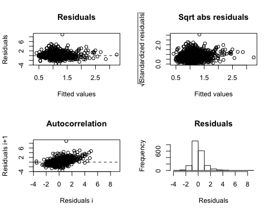

### Fourth month

m4 = nls( NEE ~ a * exp(b*TA), night[which(night$MONTH == 4),], start=list(a= trc$a , b= trc$b),
na.action=na.exclude, trace=F, control=nls.control(warnOnly=T))
summary(m4)

res.trc <- nlsResiduals(m4)
par(mfrow=c(2,2))
plot(res.trc, which=1)# Residulas vs fitted values (Constant Variance) 
plot(res.trc, which=3) # Standardized residuals
plot(res.trc, which=4) # Autocorrelation
plot(res.trc, which=5) # Histogram (Normality)
 

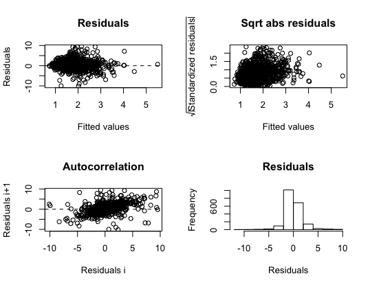

### Fifth month

m5 = nls( NEE ~ a * exp(b*TA), night[which(night$MONTH == 5),], start=list(a= trc$a , b= trc$b),
na.action=na.exclude, trace=F, control=nls.control(warnOnly=T))
summary(m5)

res.trc <- nlsResiduals(m5)
par(mfrow=c(2,2))
plot(res.trc, which=1)# Residulas vs fitted values (Constant Variance) 
plot(res.trc, which=3) # Standardized residuals
plot(res.trc, which=4) # Autocorrelation
plot(res.trc, which=5) # Histogram (Normality)
 

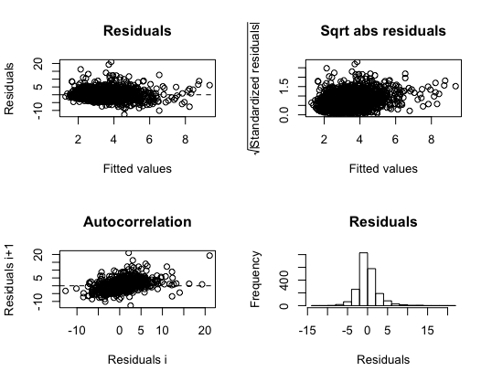

### Sixth month

m6 = nls( NEE ~ a * exp(b*TA), night[which(night$MONTH == 6),], start=list(a= trc$a , b= trc$b),
na.action=na.exclude, trace=F, control=nls.control(warnOnly=T))
summary(m6)

res.trc <- nlsResiduals(m6)
par(mfrow=c(2,2))
plot(res.trc, which=1)# Residulas vs fitted values (Constant Variance) 
plot(res.trc, which=3) # Standardized residuals
plot(res.trc, which=4) # Autocorrelation
plot(res.trc, which=5) # Histogram (Normality)

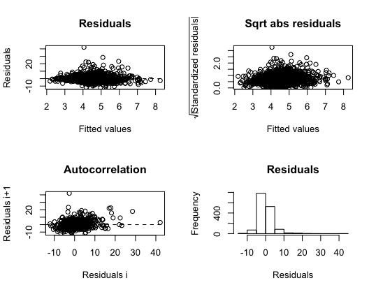

### Seventh month

m7 = nls( NEE ~ a * exp(b*TA), night[which(night$MONTH == 7),], start=list(a= trc$a , b= trc$b),
na.action=na.exclude, trace=F, control=nls.control(warnOnly=T))
summary(m7)

res.trc <- nlsResiduals(m7)
par(mfrow=c(2,2))
plot(res.trc, which=1)# Residulas vs fitted values (Constant Variance) 
plot(res.trc, which=3) # Standardized residuals
plot(res.trc, which=4) # Autocorrelation
plot(res.trc, which=5) # Histogram (Normality)
 

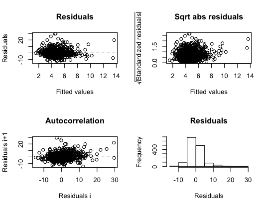

### Eigth month

m8 = nls( NEE ~ a * exp(b*TA), night[which(night$MONTH == 8),], start=list(a= trc$a , b= trc$b),
na.action=na.exclude, trace=F, control=nls.control(warnOnly=T))
summary(m8)

res.trc <- nlsResiduals(m8)
par(mfrow=c(2,2))
plot(res.trc, which=1)# Residulas vs fitted values (Constant Variance) 
plot(res.trc, which=3) # Standardized residuals
plot(res.trc, which=4) # Autocorrelation
plot(res.trc, which=5) # Histogram (Normality)
 

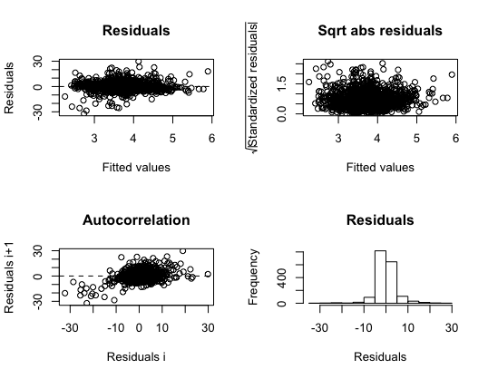

### Ninth month

m9 = nls( NEE ~ a * exp(b*TA), night[which(night$MONTH == 9),], start=list(a= trc$a , b= trc$b),
na.action=na.exclude, trace=F, control=nls.control(warnOnly=T))
summary(m9)

res.trc <- nlsResiduals(m9)
par(mfrow=c(2,2))
plot(res.trc, which=1)# Residulas vs fitted values (Constant Variance) 
plot(res.trc, which=3) # Standardized residuals
plot(res.trc, which=4) # Autocorrelation
plot(res.trc, which=5) # Histogram (Normality)

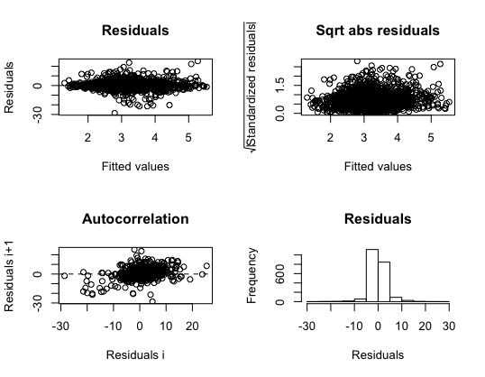

### Tenth month

m10 = nls( NEE ~ a * exp(b*TA), night[which(night$MONTH == 10),], start=list(a= trc$a , b= trc$b),
na.action=na.exclude, trace=F, control=nls.control(warnOnly=T))
summary(m10)

res.trc <- nlsResiduals(m10)
par(mfrow=c(2,2))
plot(res.trc, which=1)# Residulas vs fitted values (Constant Variance) 
plot(res.trc, which=3) # Standardized residuals
plot(res.trc, which=4) # Autocorrelation
plot(res.trc, which=5) # Histogram (Normality)
 

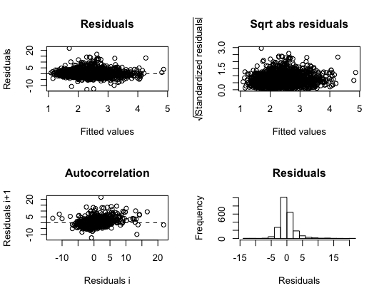

### Eleventh month

m11 = nls( NEE ~ a * exp(b*TA), night[which(night$MONTH == 11),], start=list(a= trc$a , b= trc$b),
na.action=na.exclude, trace=F, control=nls.control(warnOnly=T))
summary(m11)

res.trc <- nlsResiduals(m11)
par(mfrow=c(2,2))
plot(res.trc, which=1)# Residulas vs fitted values (Constant Variance) 
plot(res.trc, which=3) # Standardized residuals
plot(res.trc, which=4) # Autocorrelation
plot(res.trc, which=5) # Histogram (Normality)

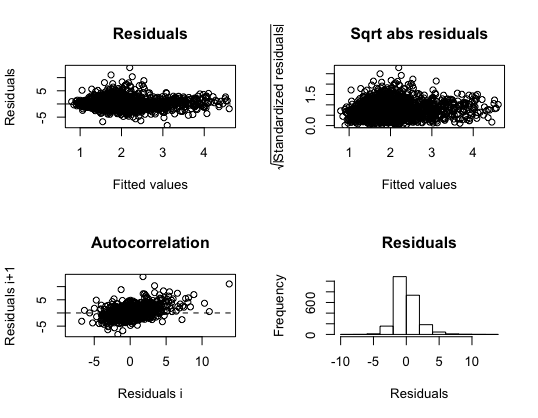

### Twelveth month

m12 = nls( NEE ~ a * exp(b*TA), night[which(night$MONTH == 12),], start=list(a= trc$a , b= trc$b),
na.action=na.exclude, trace=F, control=nls.control(warnOnly=T))
summary(m12)

res.trc <- nlsResiduals(m12)
par(mfrow=c(2,2))
plot(res.trc, which=1)# Residulas vs fitted values (Constant Variance) 
plot(res.trc, which=3) # Standardized residuals
plot(res.trc, which=4) # Autocorrelation
plot(res.trc, which=5) # Histogram (Normality)

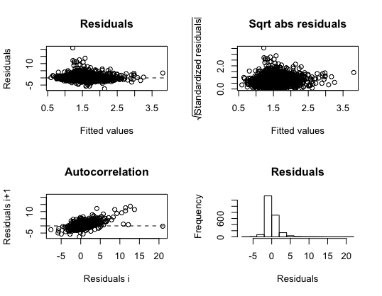

# How variable are NEE rates over an annual cycle in Harvard Forest?
Harvard Forest is a mixed temperate forest. We want to quantify just how variable rates of NEE are monthly. To do this we will fit temperature response curves monthly and compare parameter values.

##Workflow:
1. Create a dataframe to store month parameter values (parms.Month).
2. Write a function to the fit model and extract paramters (nee.night).
3. Write a loop to fit monthly curves and add parameters to a dataframe (parms.Month). 
4. Bootstrapping for error estimation.

## Create a dataframe to store monthly parameter values (parms.Month):

parms.Month <- data.frame(
  MONTH=numeric(),
  a=numeric(),
  b=numeric(), 
  a.pvalue=numeric(),
  b.pvalue=numeric(), stringsAsFactors=FALSE, row.names=NULL)

#### Creates time file to merge with parm file:

parms.Month[1:12, 1] <- seq(1,12,1) 
 

## Write a function to the fit model and extract parameters (nee.night):

nee.night <- function(dataframe){y.df = nls(NEE ~ a * exp(b*TA), 
                                            dataframe, start=list(a= iv$a , b=iv$b ),
                                            na.action=na.exclude, trace=F,
                                            control=nls.control(warnOnly=T))

y.df <- as.data.frame(cbind(t(coef(summary(y.df))[1:2, 1]), t(coef(summary(y.df)) [1:2, 4])))

names(y.df) <- c("a", "b", "a.pvalue", "b.pvalue")                      
return(y.df)}
 

## Write a loop to fit monthly curves and add parameters to a dataframe (parms.Month) (1:12):

try(for(j in unique(night$MONTH)){
  print(j)
 

### Determines starting values:

iv <- getInitial(NEE ~ SS.trc('TA', "a", "b"), data = night[which(night$MONTH == j),]) 
 
  
### Fits temperature response curve:

y4 <- try(nee.night(night[which(night$MONTH == j),]), silent=T) # Fit night model
 
  
### Extracts data and saves it in the dataframe

  try(parms.Month[c(parms.Month$MONTH == j ), 2:5 ] <- cbind(y4), silent=T)
  
  rm(y4)
}, silent=T)

parms.Month

summary(parms.Month) 

### Creating a table for the parms.Month results

library(knitr)
library(kableExtra)
library(magick)

kable(parms.Month[1:12, ], format = "html", digits = 1) %>%
  kable_styling(bootstrap_options = "striped", full_width = F)
 

## Bootstrapping for error estimation

### Create file to store parms and se

boot.NEE <- data.frame(parms.Month[, c("MONTH")]); names (boot.NEE) <- "MONTH"
boot.NEE$a.est<- 0
boot.NEE$b.est<- 0
boot.NEE$a.se<- 0
boot.NEE$b.se<- 0
 

### Night Model:

for ( j in unique(boot.NEE$MONTH)){
  print(j)
  y1 <-night[which(night$MONTH == j),]
 

### Determines the starting values:  

  iv <- getInitial(NEE ~ SS.trc('TA',"a", "b"), data = y1) 

### Fit curve:  

  night.fit <- nls(NEE ~ a * exp(b*TA), 
                   data=y1, start=list(a= iv$a , b=iv$b ),
                   na.action=na.exclude, trace=F,
                   control=nls.control(warnOnly=T))
 
  
### Bootstrap and extract values:

  try(results <- nlsBoot(night.fit, niter=100 ), silent=T)
  try(a <- t(results$estiboot)[1, 1:2], silent=T)
  try(names(a) <- c('a.est', 'b.est'), silent=T)
  try(b <- t(results$estiboot)[2, 1:2], silent=T)
  try(names(b) <- c('a.se', 'b.se'), silent=T)
  try(c <- t(data.frame(c(a,b))), silent=T)
 

### Add bootstrap data to dataframe:

  try(boot.NEE[c(boot.NEE$MONTH == j), 2:5] <- c[1, 1:4], silent=T)
  try(rm(night.fit, a, b, c, results, y1), silent=T)
}

trc <- merge( parms.Month, boot.NEE)

trc

summary(trc)

library("papeR")
kable(summary(trc), format = "html", digits = 1)%>%
  kable_styling(bootstrap_options = "striped", full_width = F)

<table class="table table-striped" style="width: auto !important; margin-left: auto; margin-right: auto;">
 <thead>
  <tr>
   <th style="text-align:left;">   </th>
   <th style="text-align:left;">     MONTH </th>
   <th style="text-align:left;">       a </th>
   <th style="text-align:left;">       b </th>
   <th style="text-align:left;">    a.pvalue </th>
   <th style="text-align:left;">    b.pvalue </th>
   <th style="text-align:left;">     a.est </th>
   <th style="text-align:left;">     b.est </th>
   <th style="text-align:left;">      a.se </th>
   <th style="text-align:left;">      b.se </th>
  </tr>
 </thead>
<tbody>
  <tr>
   <td style="text-align:left;">  </td>
   <td style="text-align:left;"> Min.   : 1.00 </td>
   <td style="text-align:left;"> Min.   :1.101 </td>
   <td style="text-align:left;"> Min.   :-0.01423 </td>
   <td style="text-align:left;"> Min.   :0.000e+00 </td>
   <td style="text-align:left;"> Min.   :0.000000 </td>
   <td style="text-align:left;"> Min.   :1.101 </td>
   <td style="text-align:left;"> Min.   :-0.01416 </td>
   <td style="text-align:left;"> Min.   :0.02510 </td>
   <td style="text-align:left;"> Min.   :0.003356 </td>
  </tr>
  <tr>
   <td style="text-align:left;">  </td>
   <td style="text-align:left;"> 1st Qu.: 3.75 </td>
   <td style="text-align:left;"> 1st Qu.:1.279 </td>
   <td style="text-align:left;"> 1st Qu.: 0.03380 </td>
   <td style="text-align:left;"> 1st Qu.:0.000e+00 </td>
   <td style="text-align:left;"> 1st Qu.:0.000000 </td>
   <td style="text-align:left;"> 1st Qu.:1.275 </td>
   <td style="text-align:left;"> 1st Qu.: 0.03415 </td>
   <td style="text-align:left;"> 1st Qu.:0.04410 </td>
   <td style="text-align:left;"> 1st Qu.:0.004018 </td>
  </tr>
  <tr>
   <td style="text-align:left;">  </td>
   <td style="text-align:left;"> Median : 6.50 </td>
   <td style="text-align:left;"> Median :1.677 </td>
   <td style="text-align:left;"> Median : 0.03860 </td>
   <td style="text-align:left;"> Median :0.000e+00 </td>
   <td style="text-align:left;"> Median :0.000000 </td>
   <td style="text-align:left;"> Median :1.677 </td>
   <td style="text-align:left;"> Median : 0.03876 </td>
   <td style="text-align:left;"> Median :0.07721 </td>
   <td style="text-align:left;"> Median :0.004720 </td>
  </tr>
  <tr>
   <td style="text-align:left;">  </td>
   <td style="text-align:left;"> Mean   : 6.50 </td>
   <td style="text-align:left;"> Mean   :1.889 </td>
   <td style="text-align:left;"> Mean   : 0.03640 </td>
   <td style="text-align:left;"> Mean   :3.748e-11 </td>
   <td style="text-align:left;"> Mean   :0.008777 </td>
   <td style="text-align:left;"> Mean   :1.904 </td>
   <td style="text-align:left;"> Mean   : 0.03641 </td>
   <td style="text-align:left;"> Mean   :0.18969 </td>
   <td style="text-align:left;"> Mean   :0.005568 </td>
  </tr>
  <tr>
   <td style="text-align:left;">  </td>
   <td style="text-align:left;"> 3rd Qu.: 9.25 </td>
   <td style="text-align:left;"> 3rd Qu.:1.867 </td>
   <td style="text-align:left;"> 3rd Qu.: 0.04601 </td>
   <td style="text-align:left;"> 3rd Qu.:0.000e+00 </td>
   <td style="text-align:left;"> 3rd Qu.:0.000000 </td>
   <td style="text-align:left;"> 3rd Qu.:1.878 </td>
   <td style="text-align:left;"> 3rd Qu.: 0.04541 </td>
   <td style="text-align:left;"> 3rd Qu.:0.23695 </td>
   <td style="text-align:left;"> 3rd Qu.:0.007198 </td>
  </tr>
  <tr>
   <td style="text-align:left;">  </td>
   <td style="text-align:left;"> Max.   :12.00 </td>
   <td style="text-align:left;"> Max.   :4.799 </td>
   <td style="text-align:left;"> Max.   : 0.05711 </td>
   <td style="text-align:left;"> Max.   :4.284e-10 </td>
   <td style="text-align:left;"> Max.   :0.105324 </td>
   <td style="text-align:left;"> Max.   :4.906 </td>
   <td style="text-align:left;"> Max.   : 0.05714 </td>
   <td style="text-align:left;"> Max.   :1.00424 </td>
   <td style="text-align:left;"> Max.   :0.010848 </td>
  </tr>
</tbody>
</table>

# Results

The figures above depict the visual assessment of the model assumptions from the Selfstart nonlinear model.

When evaluating the assumptions from the visual assessments we see the following:

Normality: Histogram of the residuals.
Homogeneous variance: Investigated using a scatter plot between the residual and predicted response variable.
Residual mean: You want residuals close to zero.

For the figure above and the monthly-made figures as well, the histograms have a normal distribution and the residual means are close to zero.

As can be seen, as a result of high autocorrelation, the standard errors of parameter estimates from these models are artificially small, and statistical tests are not valid. Therefore, analysis are presented in a descriptive context.

Finding good starting values is very important to allow the model algorithm to converge. 
If you set starting parameters values completely outside of the range of potential parameter values the algorithm will either fail or it will return non-sensical parameter estimates. Here we used R’s self-starting models.

The initial values found with the Selfstart were:

$a
[1] 1.451937

$b
[1] 0.043954

<table class="table table-striped" style="width: auto !important; margin-left: auto; margin-right: auto;">
 <thead>
  <tr>
   <th style="text-align:right;"> MONTH </th>
   <th style="text-align:right;"> a </th>
   <th style="text-align:right;"> b </th>
   <th style="text-align:right;"> a.pvalue </th>
   <th style="text-align:right;"> b.pvalue </th>
  </tr>
 </thead>
<tbody>
  <tr>
   <td style="text-align:right;"> 1 </td>
   <td style="text-align:right;"> 1.282263 </td>
   <td style="text-align:right;"> 0.0279018 </td>
   <td style="text-align:right;"> 0 </td>
   <td style="text-align:right;"> 0.0000000 </td>
  </tr>
  <tr>
   <td style="text-align:right;"> 2 </td>
   <td style="text-align:right;"> 1.235765 </td>
   <td style="text-align:right;"> 0.0313632 </td>
   <td style="text-align:right;"> 0 </td>
   <td style="text-align:right;"> 0.0000000 </td>
  </tr>
  <tr>
   <td style="text-align:right;"> 3 </td>
   <td style="text-align:right;"> 1.100977 </td>
   <td style="text-align:right;"> 0.0382211 </td>
   <td style="text-align:right;"> 0 </td>
   <td style="text-align:right;"> 0.0000000 </td>
  </tr>
  <tr>
   <td style="text-align:right;"> 4 </td>
   <td style="text-align:right;"> 1.270271 </td>
   <td style="text-align:right;"> 0.0477822 </td>
   <td style="text-align:right;"> 0 </td>
   <td style="text-align:right;"> 0.0000000 </td>
  </tr>
  <tr>
   <td style="text-align:right;"> 5 </td>
   <td style="text-align:right;"> 1.755597 </td>
   <td style="text-align:right;"> 0.0571120 </td>
   <td style="text-align:right;"> 0 </td>
   <td style="text-align:right;"> 0.0000000 </td>
  </tr>
  <tr>
   <td style="text-align:right;"> 6 </td>
   <td style="text-align:right;"> 2.400125 </td>
   <td style="text-align:right;"> 0.0389880 </td>
   <td style="text-align:right;"> 0 </td>
   <td style="text-align:right;"> 0.0000000 </td>
  </tr>
  <tr>
   <td style="text-align:right;"> 7 </td>
   <td style="text-align:right;"> 2.005208 </td>
   <td style="text-align:right;"> 0.0454237 </td>
   <td style="text-align:right;"> 0 </td>
   <td style="text-align:right;"> 0.0000000 </td>
  </tr>
  <tr>
   <td style="text-align:right;"> 8 </td>
   <td style="text-align:right;"> 4.798788 </td>
   <td style="text-align:right;"> -0.0142284 </td>
   <td style="text-align:right;"> 0 </td>
   <td style="text-align:right;"> 0.1053243 </td>
  </tr>
  <tr>
   <td style="text-align:right;"> 9 </td>
   <td style="text-align:right;"> 1.821047 </td>
   <td style="text-align:right;"> 0.0369579 </td>
   <td style="text-align:right;"> 0 </td>
   <td style="text-align:right;"> 0.0000000 </td>
  </tr>
  <tr>
   <td style="text-align:right;"> 10 </td>
   <td style="text-align:right;"> 1.679584 </td>
   <td style="text-align:right;"> 0.0392426 </td>
   <td style="text-align:right;"> 0 </td>
   <td style="text-align:right;"> 0.0000000 </td>
  </tr>
  <tr>
   <td style="text-align:right;"> 11 </td>
   <td style="text-align:right;"> 1.674095 </td>
   <td style="text-align:right;"> 0.0533639 </td>
   <td style="text-align:right;"> 0 </td>
   <td style="text-align:right;"> 0.0000000 </td>
  </tr>
  <tr>
   <td style="text-align:right;"> 12 </td>
   <td style="text-align:right;"> 1.641407 </td>
   <td style="text-align:right;"> 0.0346170 </td>
   <td style="text-align:right;"> 0 </td>
   <td style="text-align:right;"> 0.0000000 </td>
  </tr>
</tbody>
</table>

The table above shows the parms.Month results. As can be seen, as a result of high autocorrelation, the standard errors of parameter estimates from these models are artificially small, and statistical tests are not valid. Therefore, analysis are presented in a descriptive context.

# Discussion

First, the photosynthetic potential is discussed. Photosynthetically Active Radiation is needed for photosynthesis and plant growth. Higher PAR promotes plant growth, and monitoring monitoring PAR is important to ensure plants are receiving adequate light for this process. PAR values range from 0 to 3,000 millimoles per square meter. At night, however, PAR is zero. This was illustrated in figure 1.

In terms of ecosystem respiration, The TA, as it rose, came with higher variance in Net Ecosystem Exchange Rates. When TA fell below 0, NEE was maintained at an average of 0, but when the TA range was 15-25, the NEE varied from -20 to 20. This may be because the rate of respiration in a plant cell decreases when temperature decreases until respiration nearly or completely halts around freezing temperatures. Also, respiration increases with increasing temperatures until very high temperatures are reached and result in tissue deterioration, possibly causing the high NEE variance we see as the TA reachest the highest observed levels. In the summary of the use initial values in the model, there is no termination occurring before convergence upon completion of maximum iterations, in the case of a singular gradient, and in the case that the step-size factor is reduced below a minimum factor. The starting values are not an issue here.

In terms of final analysis, the selfstart value "a" = 1.451937 seemed to be close in range with non-summer months (1-4, and 10-12), while "b" = 0.043954 seemed to stay similar for most months except fot August.  Months 5-9 seem to have the highest "a" values in the parms.Month results. the variable "a" standing for base respiration rate when air temperature is 0 C. Months 5-9 or May through September seem to correlate with summer months, meaning that respiration may be higher in summer than Winter or Spring. This makes sense since temperature greatly affects respiration for maintenance (much more than cells dedicated to plant growth). Plants in temperate climates have much lower respiration rates in winter than during warm summers. The high a value seems to indicate the growing season, where month 8 is twice as high as the second highest a value, signifying that this month may be when there is highest base respiration rate occurring. Because we analyzed night data, during this time, only respiration takes place. Oxygen is consumed while carbon dioxide is released. Since an increase in available sugars from photosynthesis generally leads to an increased rate of respiration, it is likely that during the daytime, photosynthetic potential is highest during the same months that respiration is highest, in the summer months.