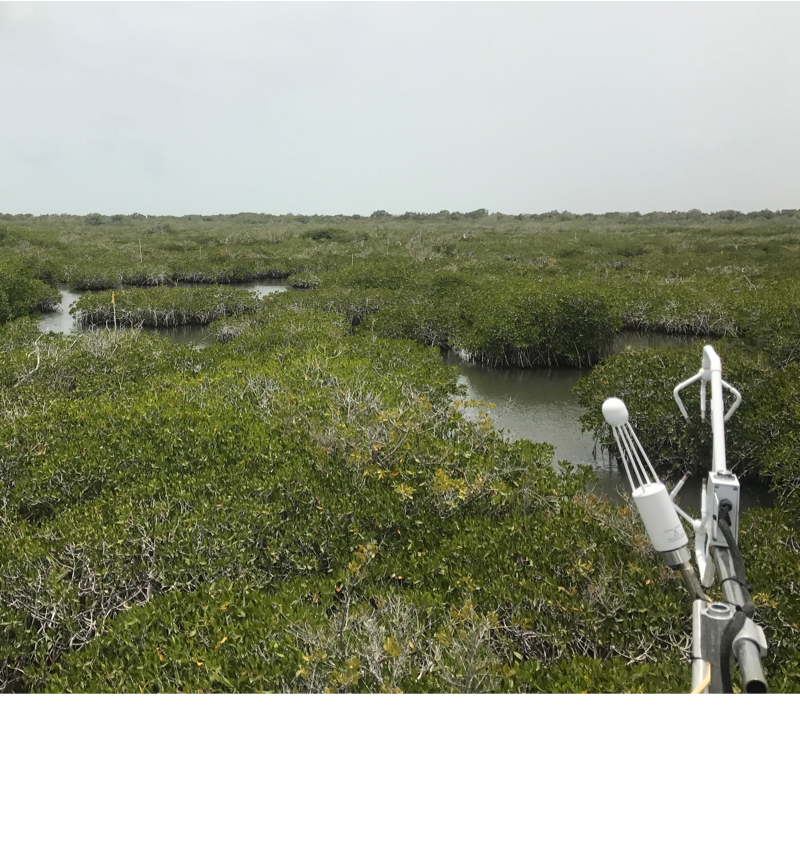
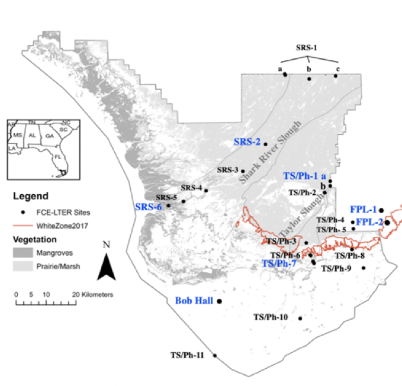
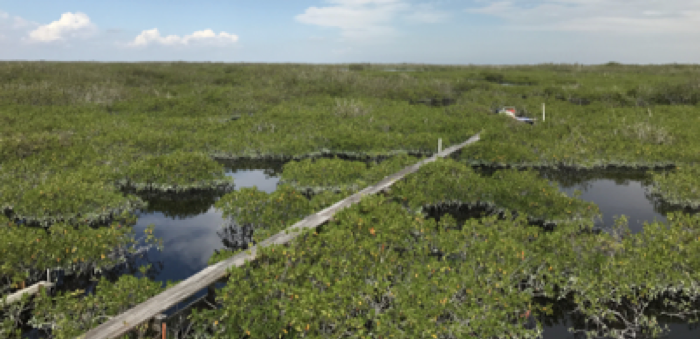

```{r setup, include=FALSE}
knitr::opts_chunk$set(echo = TRUE)
```


# Objectives
The primary objectives of this analysis is ...

1 Plot, examine, and prepare time series for modeling

2 Extract the seasonality component from the time series

3 Test for stationarity and apply appropriate transformations

4 Choose the order of an ARIMA model


# Methods

## Site Information 

The data provided in ARIMA_Workshop includes one data set of daily rates of NEE for a tower site in a mangrove scrub (mangroves) along the coast of Florida. The dataset includes gap-filled NEE (g C m2 day−1). Data was obtained from an eddy covariance tower in Everglades National Park at the Florida Coastal Everglades Long-term Ecological Research site TS/Ph-7. Data includes NEE (g C m2 day−1), total daily PAR (par; W m−2 day−1), air temperature (tair; C), water temperature minimum and maximum, (water.tmax and water.min; C), and water salinity minimum, maximum, and mean (salinity.min, salinity.max, salinity.mean; ppt).

In this report, there is a focus on NEE (g C m2 day−1), and water temperature maximum, (water.tmax; C).





## Statistical Analysis

load("/Users/helen/Documents/EcologyRWorkshop/Time_Series_Analysis/Github/ARIMA_Workshop.RData")

library(zoo)
library(tseries)
library(forecast)
library(xts)
library(fracdiff)

### Starting with NEE Practice data:

#### Part 1:
##### 1. Create timeseries objects:

In the frequency parameter in the ts() object, we are specifying periodicity of the data, i.e.,

nee <- ts( mangroves$nee, start= 1, frequency=30)

##### Visualize data:

The timeseries is visually examined for any outliers, volatility, or irregularities. (LEFT). 
Any outliers that could bias the model by skewing statistical summaries are removed using series smoothing and decomposition. (RIGHT).

par(mfrow=c(1,1), mai=c(1.25,0.8,0.1, 0.1))
plot( nee, typ="l", ylab= "NEE", xlab="")

plot(nee)
lines(tsclean(nee), col="red")


nee <- tsclean(nee)

#### 2. Decompose the timeseries:

Deconstructing helps prepare a foundation for building an ARIMA model:

nee.d <- decompose(nee, 'multiplicative')
plot(nee.d)


#### 3.a. Test for stationarity
Fitting an ARIMA model requires the series to be stationary. The augmented Dickey-Fuller (ADF) test was run as a formal statistical test for stationarity. The null hypothesis assumes that the series is non-stationary.

##### p-value < 0.05 indicates the TS is stationary
adf.test(nee)

Augmented Dickey-Fuller Test

data:  nee
Dickey-Fuller = -4.4703, Lag order = 7, p-value = 0.01
alternative hypothesis: stationary

#### 3.b. Detecting Autocorrelation:

The following autocorrelation plots (also known as ACF or the auto correlation function) display correlation between a series and its lags.

On the left, ACF plots help in determining the order of the MA (q) model. The partial autocorrelation plots (PACF) on the right display correlation between a variable and its lags that is not explained by previous lags.

acf(nee, lag.max=45) # (LEFT)

pacf(nee, lag.max=45) # (RIGHT)


#### 4. Fitting an ARIMA Model:
This function searches through combinations of order parameters and picks the set that optimizes model fit criteria.

arima.nee1 <-auto.arima(nee, trace=TRUE)

```{r}
# ARIMA(2,1,3)(2,0,2)[30]                    : 706.7137

# Best: ARIMA(2,1,3)(2,0,2)[30]   
```

tsdisplay(residuals(arima.nee1), lag.max=45)

arima.nee2 <-arima(nee , order=c(10,1,3), seasonal= list(order=c(2,0,2)))

```{r}
# Warning message:
# In arima(nee, order = c(10, 1, 3), seasonal = list(order = c(2,  :
  #possible convergence problem: optim gave code = 1  
```

tsdisplay(residuals(arima.nee2), lag.max= 30)

NEE Residual graphs for NEE1 (Left) and NEE2 (Right)

 


##### You want to minimize AIC
AIC(arima.nee1, arima.nee2)

kable(AIC(arima.nee1,arima.nee2 ), format = "html", digits = 1) %>%
  kable_styling(bootstrap_options = "striped", full_width = F)

<table class="table table-striped" style="width: auto !important; margin-left: auto; margin-right: auto;">
 <thead>
  <tr>
   <th style="text-align:left;">   </th>
   <th style="text-align:right;"> df </th>
   <th style="text-align:right;"> AIC </th>
  </tr>
 </thead>
<tbody>
  <tr>
   <td style="text-align:left;"> arima.nee1 </td>
   <td style="text-align:right;"> 10 </td>
   <td style="text-align:right;"> 706.1 </td>
  </tr>
  <tr>
   <td style="text-align:left;"> arima.nee2 </td>
   <td style="text-align:right;"> 18 </td>
   <td style="text-align:right;"> 704.8 </td>
  </tr>
</tbody>
</table>

par(mfrow=c(1,1))
plot(nee , typ="l"); lines(fitted(arima.nee2),col="red")

##### Measuring for significant difference from white noise.
##### p-value greater than 0.05!
checkresiduals(arima.nee2, lag=36)

par(mfrow=c(1,1))
plot(nee , typ="l"); lines(fitted(arima.nee2),col="red")

plot(forecast(arima.nee2, h=30))


### Using water.tmax to develop a better model:

#### Part 1:
##### 1. Create timeseries objects:

In the frequency parameter in the ts() object, we are specifying periodicity of the data, i.e.,

wat <- ts( mangroves$water.tmax, start= 1, frequency=30)

##### Visualize data:

The timeseries is visually examined for any outliers, volatility, or irregularities. (LEFT). 
Any outliers that could bias the model by skewing statistical summaries are removed using series smoothing and decomposition. (RIGHT).

par(mfrow=c(1,1), mai=c(1.25,0.8,0.1, 0.1))
plot( wat, typ="l", ylab= "WaterTemp", xlab="")

plot(wat, typ="l", ylab= "WaterTemp", xlab="")
lines(tsclean(wat), col="red")


wat <- tsclean(wat)

#### 2. Decompose the timeseries:

Deconstructing helps prepare a foundation for building an ARIMA model:

wat.d <- decompose(wat, 'multiplicative')
plot(wat.d)


#### 3. Test for stationarity
Fitting an ARIMA model requires the series to be stationary. The augmented Dickey-Fuller (ADF) test is a formal statistical test for stationarity. The null hypothesis null hypothesis was not rejected, so the time series was differentiated. After differentiation, the null hypothesis was rejected.

###### p-value < 0.05 indicates the TS is stationary
adf.test(wat)

```{r}
#Augmented Dickey-Fuller Test

#data:  wat
#Dickey-Fuller = -2.1936, Lag order = 7, p-value = 0.4952
#alternative hypothesis: stationary

```

adf.test(diff(wat))

```{r}
#Augmented Dickey-Fuller Test

#data:  diff(wat)
#Dickey-Fuller = -9.4432, Lag order = 7, p-value = 0.01
#alternative hypothesis: stationary
```

#### 4. Explore correlations.
Look for significant lags.

ccf( diff(wat),nee, na.action = na.pass, lag.max=40, plot=TRUE)


#### 5. Explore Models of NEE.
arima.nee3 <-auto.arima(nee, xreg=c(diff(wat),0), trace=TRUE)

```{r}
#ARIMA(3,1,1)(2,0,1)[30]                    : 698.1553

# Best model: Regression with ARIMA(3,1,1)(2,0,1)[30] errors 
```

##### Compare to current model
AIC(arima.nee2, arima.nee3 )

kable(AIC(arima.nee2,arima.nee3 ), format = "html", digits = 1) %>%
  kable_styling(bootstrap_options = "striped", full_width = F)

<table class="table table-striped" style="width: auto !important; margin-left: auto; margin-right: auto;">
 <thead>
  <tr>
   <th style="text-align:left;">   </th>
   <th style="text-align:right;"> df </th>
   <th style="text-align:right;"> AIC </th>
  </tr>
 </thead>
<tbody>
  <tr>
   <td style="text-align:left;"> arima.nee2 </td>
   <td style="text-align:right;"> 18 </td>
   <td style="text-align:right;"> 704.8 </td>
  </tr>
  <tr>
   <td style="text-align:left;"> arima.nee3 </td>
   <td style="text-align:right;"> 9 </td>
   <td style="text-align:right;"> 697.6 </td>
  </tr>
</tbody>
</table>

par(mfrow=c(1,1))
plot(nee , typ="l"); lines(fitted(arima.nee3),col="red")

So, adding water temperature to nee did improve the model. Maybe extreme water temperature is more important. Lets create a water temperature index to ID when water temperature values are greater than 25n ppt.

wat.i <- wat
wat.i[wat.i < 25 ]<- 0
wat.i[wat.i >= 25 ]<- 1
plot(wat.i)


arima.nee4 <-auto.arima(nee, xreg=wat.i, trace=TRUE)

```{r}
#ARIMA(0,1,3)(2,0,1)[30]                    : 692.1087

# Best model: Regression with ARIMA(0,1,3)(2,0,1)[30] errors 
```

AIC(arima.nee2,arima.nee4 )

kable(AIC(arima.nee2,arima.nee4 ), format = "html", digits = 1) %>%
  kable_styling(bootstrap_options = "striped", full_width = F)
  
<table class="table table-striped" style="width: auto !important; margin-left: auto; margin-right: auto;">
 <thead>
  <tr>
   <th style="text-align:left;">   </th>
   <th style="text-align:right;"> df </th>
   <th style="text-align:right;"> AIC </th>
  </tr>
 </thead>
<tbody>
  <tr>
   <td style="text-align:left;"> arima.nee2 </td>
   <td style="text-align:right;"> 18 </td>
   <td style="text-align:right;"> 704.8 </td>
  </tr>
  <tr>
   <td style="text-align:left;"> arima.nee4 </td>
   <td style="text-align:right;"> 8 </td>
   <td style="text-align:right;"> 691.7 </td>
  </tr>
</tbody>
</table>

checkresiduals(arima.nee4, lag=36)


par(mfrow=c(1,1))
plot(nee , typ="l"); lines(fitted(arima.nee4),col="red")


# Results (minimum of 1 plot and one table)

Below are the two fitted lines which were best fit for their corresponding variables. The left graph looks at the temporal dynamics with a different specification than the initial nee fitted model, where there is a clear pattern present in ACF/PACF with model residuals plots repeating at lag 10 in nee. The right graph looks at a fitted line of nee with water temperature data added, where an index was made to ID when water temperature values are greater than 25.


To compare models, you use the AIC. You also want to compare observed versus predicted values. You want to minimize AIC. Below is the nee fitting process allowing for the MA(10) component and examine diagnostic plots again:

<table class="table table-striped" style="width: auto !important; margin-left: auto; margin-right: auto;">
 <thead>
  <tr>
   <th style="text-align:left;">   </th>
   <th style="text-align:right;"> df </th>
   <th style="text-align:right;"> AIC </th>
  </tr>
 </thead>
<tbody>
  <tr>
   <td style="text-align:left;"> arima.nee1 </td>
   <td style="text-align:right;"> 10 </td>
   <td style="text-align:right;"> 706.1 </td>
  </tr>
  <tr>
   <td style="text-align:left;"> arima.nee2 </td>
   <td style="text-align:right;"> 18 </td>
   <td style="text-align:right;"> 704.8 </td>
  </tr>
</tbody>
</table>

Max water temperature data was added to nee and the following was observed:

<table class="table table-striped" style="width: auto !important; margin-left: auto; margin-right: auto;">
 <thead>
  <tr>
   <th style="text-align:left;">   </th>
   <th style="text-align:right;"> df </th>
   <th style="text-align:right;"> AIC </th>
  </tr>
 </thead>
<tbody>
  <tr>
   <td style="text-align:left;"> arima.nee2 </td>
   <td style="text-align:right;"> 18 </td>
   <td style="text-align:right;"> 704.8 </td>
  </tr>
  <tr>
   <td style="text-align:left;"> arima.nee3 </td>
   <td style="text-align:right;"> 9 </td>
   <td style="text-align:right;"> 697.6 </td>
  </tr>
</tbody>
</table>

Adding water temperature to nee did improve the model. Maybe extreme water temperature can refine and improve the model as well.

<table class="table table-striped" style="width: auto !important; margin-left: auto; margin-right: auto;">
 <thead>
  <tr>
   <th style="text-align:left;">   </th>
   <th style="text-align:right;"> df </th>
   <th style="text-align:right;"> AIC </th>
  </tr>
 </thead>
<tbody>
  <tr>
   <td style="text-align:left;"> arima.nee2 </td>
   <td style="text-align:right;"> 18 </td>
   <td style="text-align:right;"> 704.8 </td>
  </tr>
  <tr>
   <td style="text-align:left;"> arima.nee4 </td>
   <td style="text-align:right;"> 8 </td>
   <td style="text-align:right;"> 691.7 </td>
  </tr>
</tbody>
</table>

Adding extreme water temperature to nee also improved the model.
With each step in trying to create a better model for this ecosystem, the AIC decreased.

# Discussion (1 paragrapgh)

We can see from the models generated that the Net Ecosystem Exchange rates plummit around months 2 to 4, mostly winter-inclusive months where water temperatures may decline. Then there is a rise in NEE in months 5 to 6, mostly spring-inclusive monthswhere water temperature may increase. The NEE then stabilizes through the mostly summer and spring months from months 6 to 12. This workshop enabled the use of an explanatory series for the improval of models rying to estimate NEE for this ecosystem. Here, NEE (g C m2 day−1), and water temperature maximum, (water.tmax; C) were the variables analyzed, where the best fitting model was created using variables relating to extreme water temperature data. Typically, high salt, low temperature, drought and high temperature are common abiotic stress conditions that adversely affect plant growth and production. Observing a better fitting model with the inclusion of the max water temperature supports the notion that the temperature of water may be an important regulator of the presence or absence of mangroves and their photosynthetic potential.