```{r setup, include=FALSE}
knitr::opts_chunk$set(echo = TRUE)
```


# Objectives
The primary objectives of this analysis is ...

# Methods

load("/Users/helen/Documents/EcologyRWorkshop/Time_Series_Analysis/Github/ARIMA_Workshop.RData")

library(zoo)
library(tseries)
library(forecast)
library(xts)
library(fracdiff)

## Starting with NEE Practice data:

#### Part 1:
##### 1. Create timeseries objects:

In the frequency parameter in the ts() object, we are specifying periodicity of the data, i.e.,

nee <- ts( mangroves$nee, start= 1, frequency=30)

##### Visualize data:

A good starting point is to plot the timeseries and visually examine it for any outliers, volatility, or
irregularities.

par(mfrow=c(1,1), mai=c(1.25,0.8,0.1, 0.1))
plot( nee, typ="l", ylab= "NEE", xlab="")

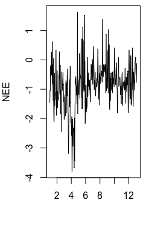


You want to remove any outliers that could bias the model by skewing statistical summaries. R provides a convenient method for removing time series outliers: tsclean() as part of its forecast package. tsclean() identifies and replaces outliers using series smoothing and decomposition.

plot(nee)
lines(tsclean(nee), col="red")

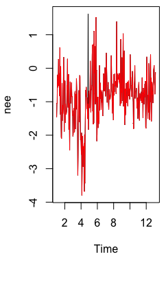

nee <- tsclean(nee)

#### 2. Decompose the timeseries:

Time series analysis involves trying to separate the time series into the seasonal, trend and irregular components. Deconstructing the series will help you understand its behavior and prepare a foundation for building an
ARIMA model. The Seasonal component refers to fluctuations in the data related to calendar cycles. Usually, seasonality is fixed at some number; for instance, quarter or month of the year.Trend component is the overall pattern of the series. It consists of decreasing or increasing patterns that are not seasonal. This is estimated using moving averages.
The part of the series that can’t be attributed to the seasonal or trend components is referred to as residual or error.

nee.d <- decompose(nee, 'multiplicative')
plot(nee.d)

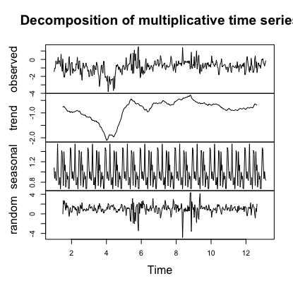

#### 3.a. Test for stationarity
Fitting an ARIMA model requires the series to be stationary. A series is stationary when its mean, variance, and autocovariance are time invariant. This assumption makes intuitive sense: Since ARIMA uses previous lags of series to model its behavior, modeling stable series with consistent properties involves less uncertainty. The augmented Dickey-Fuller (ADF) test is a formal statistical test for stationarity. The null hypothesis assumes that the series is non-stationary. ADF procedure tests whether the change in Y can be explained by
lagged value and a linear trend. If contribution of the lagged value to the change in Y is non-significant and there is a presence of a trend component, the series is non-stationary and null hypothesis will not be rejected.

##### p-value < 0.05 indicates the TS is stationary
adf.test(nee)

Augmented Dickey-Fuller Test

data:  nee
Dickey-Fuller = -4.4703, Lag order = 7, p-value = 0.01
alternative hypothesis: stationary

#### 3.b. Detecting Autocorrelation:

Autocorrelation plots (also known as ACF or the auto correlation function) are a useful visual tool in determining whether a series is stationary. ACF plots display correlation between a series and its lags.
If the series is correlated with its lags then, generally, there are some trend or seasonal components and therefore its statistical properties are not constant over time. ACF plots can help in determining the order of the MA (q) model. Partial autocorrelation plots (PACF), display correlation between a variable and its lags that is not explained by previous lags. PACF plots are useful when determining the order of the AR(p) model. R plots 95% significance boundaries as blue dotted lines.

acf(nee, lag.max=45)

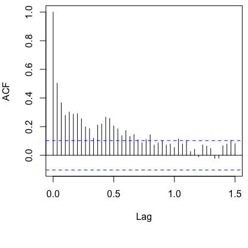

pacf(nee, lag.max=45)

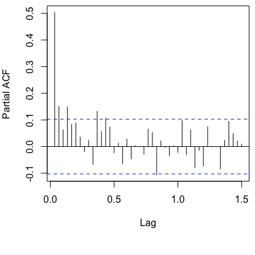

#### 4. Fitting an ARIMA Model:
Now let’s fit a model. The forecast package allows the user to explicitly specify the order of the model using the arima() function, or automatically generate a set of optimal (p, d, q) using auto.arima(). This function searches through combinations of order parameters and picks the set that optimizes model fit criteria. While auto.arima() can be very useful, it is still important to complete the steps above in order to understand the series and interpret model results.

arima.nee1 <-auto.arima(nee, trace=TRUE)

```{r}
# ARIMA(2,1,3)(2,0,2)[30]                    : 706.7137

# Best: ARIMA(2,1,3)(2,0,2)[30]   
```

tsdisplay(residuals(arima.nee1), lag.max=45)

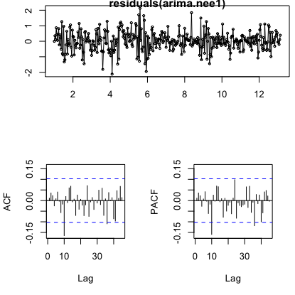

arima.nee2 <-arima(nee , order=c(10,1,3), seasonal= list(order=c(2,0,2)))

```{r}
# Warning message:
# In arima(nee, order = c(10, 1, 3), seasonal = list(order = c(2,  :
  #possible convergence problem: optim gave code = 1  
```

tsdisplay(residuals(arima.nee2), lag.max= 30)
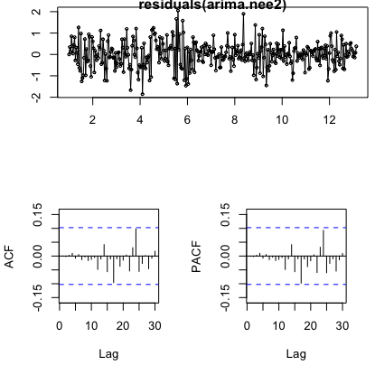

##### You want to minimize AIC
AIC(arima.nee1, arima.nee2)

kable(AIC(arima.nee1,arima.nee2 ), format = "html", digits = 1) %>%
  kable_styling(bootstrap_options = "striped", full_width = F)

<table class="table table-striped" style="width: auto !important; margin-left: auto; margin-right: auto;">
 <thead>
  <tr>
   <th style="text-align:left;">   </th>
   <th style="text-align:right;"> df </th>
   <th style="text-align:right;"> AIC </th>
  </tr>
 </thead>
<tbody>
  <tr>
   <td style="text-align:left;"> arima.nee1 </td>
   <td style="text-align:right;"> 10 </td>
   <td style="text-align:right;"> 706.1 </td>
  </tr>
  <tr>
   <td style="text-align:left;"> arima.nee2 </td>
   <td style="text-align:right;"> 18 </td>
   <td style="text-align:right;"> 704.8 </td>
  </tr>
</tbody>
</table>

par(mfrow=c(1,1))
plot(nee , typ="l"); lines(fitted(arima.nee2),col="red")

##### Measuring for significant difference from white noise.
##### You need a p-value greater than 0.05!
checkresiduals(arima.nee2, lag=36)

par(mfrow=c(1,1))
plot(nee , typ="l"); lines(fitted(arima.nee2),col="red")

plot(forecast(arima.nee2, h=30))


## Using water.tmax to develop a better model:

#### Part 1:
##### 1. Create timeseries objects:

In the frequency parameter in the ts() object, we are specifying periodicity of the data, i.e.,

wat <- ts( mangroves$water.tmax, start= 1, frequency=30)

##### Visualize data:

A good starting point is to plot the timeseries and visually examine it for any outliers, volatility, or
irregularities.

par(mfrow=c(1,1), mai=c(1.25,0.8,0.1, 0.1))
plot( wat, typ="l", ylab= "WaterTemp", xlab="")

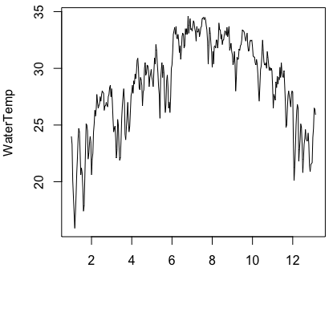

You want to remove any outliers that could bias the model by skewing statistical summaries. R provides a convenient method for removing time series outliers: tsclean() as part of its forecast package. tsclean() identifies and replaces outliers using series smoothing and decomposition.

plot(wat, typ="l", ylab= "WaterTemp", xlab="")
lines(tsclean(wat), col="red")

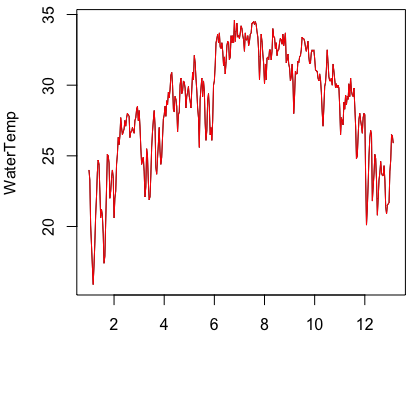

wat <- tsclean(wat)

#### 2. Decompose the timeseries:

Time series analysis involves trying to separate the time series into the seasonal, trend and irregular components. Deconstructing the series will help you understand its behavior and prepare a foundation for building an
ARIMA model. The Seasonal component refers to fluctuations in the data related to calendar cycles. Usually, seasonality is fixed at some number; for instance, quarter or month of the year.Trend component is the overall pattern of the series. It consists of decreasing or increasing patterns that are not seasonal. This is estimated using moving averages.
The part of the series that can’t be attributed to the seasonal or trend components is referred to as residual or error.

wat.d <- decompose(wat, 'multiplicative')
plot(wat.d)

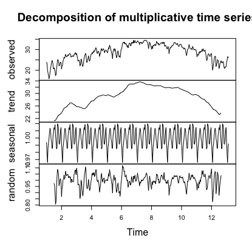

#### 3. Test for stationarity
Fitting an ARIMA model requires the series to be stationary. A series is stationary when its mean, variance, and autocovariance are time invariant. This assumption makes intuitive sense: Since ARIMA uses previous lags of series to model its behavior, modeling stable series with consistent properties involves less uncertainty. The augmented Dickey-Fuller (ADF) test is a formal statistical test for stationarity. The null hypothesis assumes that the series is non-stationary. ADF procedure tests whether the change in Y can be explained by
lagged value and a linear trend. If contribution of the lagged value to the change in Y is non-significant and there is a presence of a trend component, the series is non-stationary and null hypothesis will not be rejected.

###### p-value < 0.05 indicates the TS is stationary
adf.test(wat)

```{r}
#Augmented Dickey-Fuller Test

#data:  wat
#Dickey-Fuller = -2.1936, Lag order = 7, p-value = 0.4952
#alternative hypothesis: stationary

```

adf.test(diff(wat))

```{r}
#Augmented Dickey-Fuller Test

#data:  diff(wat)
#Dickey-Fuller = -9.4432, Lag order = 7, p-value = 0.01
#alternative hypothesis: stationary
```

#### 4. Explore correlations.
Look for significant lags.

ccf( diff(wat),nee, na.action = na.pass, lag.max=40, plot=TRUE)

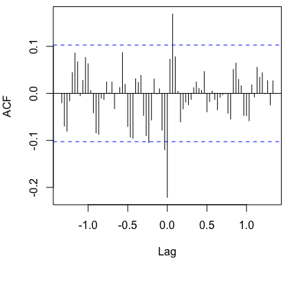

#### 5. Explore Models of NEE.
arima.nee3 <-auto.arima(nee, xreg=c(diff(wat),0), trace=TRUE)

```{r}
#ARIMA(3,1,1)(2,0,1)[30]                    : 698.1553

# Best model: Regression with ARIMA(3,1,1)(2,0,1)[30] errors 
```

##### Compare to current model
AIC(arima.nee2, arima.nee3 )

kable(AIC(arima.nee2,arima.nee3 ), format = "html", digits = 1) %>%
  kable_styling(bootstrap_options = "striped", full_width = F)

<table class="table table-striped" style="width: auto !important; margin-left: auto; margin-right: auto;">
 <thead>
  <tr>
   <th style="text-align:left;">   </th>
   <th style="text-align:right;"> df </th>
   <th style="text-align:right;"> AIC </th>
  </tr>
 </thead>
<tbody>
  <tr>
   <td style="text-align:left;"> arima.nee2 </td>
   <td style="text-align:right;"> 18 </td>
   <td style="text-align:right;"> 704.8 </td>
  </tr>
  <tr>
   <td style="text-align:left;"> arima.nee3 </td>
   <td style="text-align:right;"> 9 </td>
   <td style="text-align:right;"> 697.6 </td>
  </tr>
</tbody>
</table>

par(mfrow=c(1,1))
plot(nee , typ="l"); lines(fitted(arima.nee3),col="red")


So, adding water temperature to nee did improve the model. Maybe extreme water temperature is more important. Lets create a water temperature index to ID when water temperature values are greater than 25n ppt.

wat.i <- wat
wat.i[wat.i < 25 ]<- 0
wat.i[wat.i >= 25 ]<- 1
plot(wat.i)

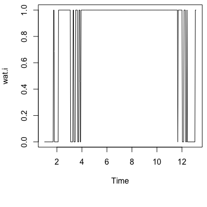

arima.nee4 <-auto.arima(nee, xreg=wat.i, trace=TRUE)

```{r}
#ARIMA(0,1,3)(2,0,1)[30]                    : 692.1087

# Best model: Regression with ARIMA(0,1,3)(2,0,1)[30] errors 
```

AIC(arima.nee2,arima.nee4 )

kable(AIC(arima.nee2,arima.nee4 ), format = "html", digits = 1) %>%
  kable_styling(bootstrap_options = "striped", full_width = F)
  
<table class="table table-striped" style="width: auto !important; margin-left: auto; margin-right: auto;">
 <thead>
  <tr>
   <th style="text-align:left;">   </th>
   <th style="text-align:right;"> df </th>
   <th style="text-align:right;"> AIC </th>
  </tr>
 </thead>
<tbody>
  <tr>
   <td style="text-align:left;"> arima.nee2 </td>
   <td style="text-align:right;"> 18 </td>
   <td style="text-align:right;"> 704.8 </td>
  </tr>
  <tr>
   <td style="text-align:left;"> arima.nee4 </td>
   <td style="text-align:right;"> 8 </td>
   <td style="text-align:right;"> 691.7 </td>
  </tr>
</tbody>
</table>

checkresiduals(arima.nee4, lag=36)

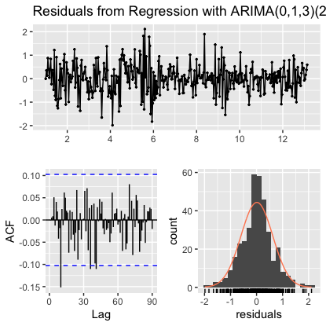

par(mfrow=c(1,1))
plot(nee , typ="l"); lines(fitted(arima.nee4),col="red")

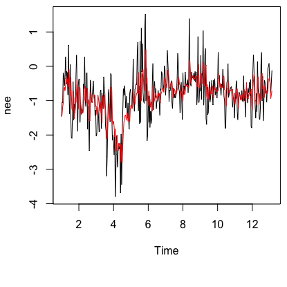

## Site Information 

## Statistical Analysis

# Results (minimum of 1 plot and one table)


To compare models, you use the AIC. You also want to compare observed versus predicted values. You want to minimize AIC

<table class="table table-striped" style="width: auto !important; margin-left: auto; margin-right: auto;">
 <thead>
  <tr>
   <th style="text-align:left;">   </th>
   <th style="text-align:right;"> df </th>
   <th style="text-align:right;"> AIC </th>
  </tr>
 </thead>
<tbody>
  <tr>
   <td style="text-align:left;"> arima.nee2 </td>
   <td style="text-align:right;"> 18 </td>
   <td style="text-align:right;"> 704.8 </td>
  </tr>
  <tr>
   <td style="text-align:left;"> arima.nee3 </td>
   <td style="text-align:right;"> 9 </td>
   <td style="text-align:right;"> 697.6 </td>
  </tr>
</tbody>
</table>

<table class="table table-striped" style="width: auto !important; margin-left: auto; margin-right: auto;">
 <thead>
  <tr>
   <th style="text-align:left;">   </th>
   <th style="text-align:right;"> df </th>
   <th style="text-align:right;"> AIC </th>
  </tr>
 </thead>
<tbody>
  <tr>
   <td style="text-align:left;"> arima.nee2 </td>
   <td style="text-align:right;"> 18 </td>
   <td style="text-align:right;"> 704.8 </td>
  </tr>
  <tr>
   <td style="text-align:left;"> arima.nee4 </td>
   <td style="text-align:right;"> 8 </td>
   <td style="text-align:right;"> 691.7 </td>
  </tr>
</tbody>
</table>

# Discussion (1 paragrapgh)
